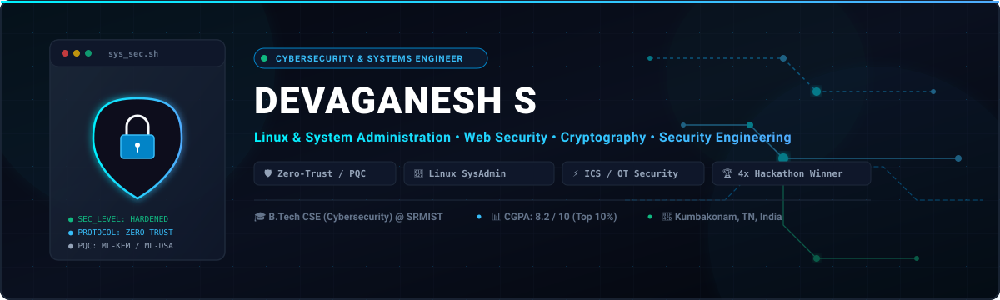
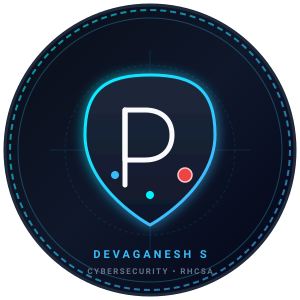

<div align="center">

  <!-- HERO BANNER -->
  

  <br /><br />

  <!-- AVATAR & IDENTITY -->
  

  <br />

  # DEVAGANESH S

  **Cybersecurity-Focused Engineer &bull; Linux &amp; System Administration &bull; Web Security &bull; Cryptography &bull; Security Engineering**

  <br />

  [](https://maps.google.com/?q=Kumbakonam,+Tamil+Nadu,+India)
  [%20%7C%20SRMIST-0F172A?style=flat-square&logo=academia&logoColor=38BDF8)](#-education)
  [](#-linux-administration--systems-engineering)
  [-10B981?style=flat-square&logo=target&logoColor=white)](#-education)
  [](#-achievements--track-record)

  <br />

  [](mailto:devaganesh0610@gmail.com)
  [](https://www.linkedin.com/in/devaganesh-shanmugam)
  [](https://github.com/devaganeshs)

</div>

<br />

---

### 📌 Technical Profile & Positioning

I am a cybersecurity-focused Computer Science undergraduate at SRM Institute of Science and Technology. My engineering focus centers on designing secure software architectures, defensible system infrastructure, and resilient threat-monitoring pipelines.

I combine deep hands-on expertise in **Linux & System Administration (RHCSA-level preparation)** with practical defensive engineering spanning **Post-Quantum Cryptography (PQC)**, **Zero-Trust policy enforcement (OPA)**, **threat detection**, **ICS/OT cyber-physical simulation**, and **full-stack backend engineering (FastAPI, Flask, React, Next.js)**. An active competitive engineer with **4 hackathon championships** and **CTF finalist rankings**, I build production-minded security solutions grounded in rigorous systems knowledge.

```
┌────────────────────────────────────────────────────────────────────────────────────────┐
│  Primary Focus: Security Engineering • Linux/SysAdmin • Web Security • Applied Crypto  │
│  Target Roles : Cybersecurity / Security Eng / SOC / Systems / Backend Internships    │
└────────────────────────────────────────────────────────────────────────────────────────┘
```

---

## ⚡ Professional Snapshot

<table>
  <tr>
    <td width="50%" valign="top">
      <h4>🛡️ Cybersecurity & Defense</h4>
      <ul>
        <li>Threat detection, phishing analysis & malware behavior inspection</li>
        <li>Vulnerability assessment, attack surface reduction & defensive hardening</li>
        <li>Zero-Trust architecture & policy-gated access enforcement (OPA)</li>
      </ul>
    </td>
    <td width="50%" valign="top">
      <h4>🐧 Linux & System Administration</h4>
      <ul>
        <li><strong>RHCSA-level Linux administration knowledge & preparation</strong></li>
        <li>OS deployment, lab infrastructure provisioning & lifecycle management</li>
        <li>Kernel/user-space diagnostics, permissions & system debugging</li>
      </ul>
    </td>
  </tr>
  <tr>
    <td width="50%" valign="top">
      <h4>🔐 Cryptography & Emerging Tech</h4>
      <ul>
        <li>Post-Quantum Cryptographic primitives (<strong>ML-KEM, ML-DSA, SLH-DSA</strong>)</li>
        <li>Cryptography Bill of Materials (CBOM) & verifiable credentials</li>
        <li>Privacy-preserving selective disclosure & cryptographic attestation</li>
      </ul>
    </td>
    <td width="50%" valign="top">
      <h4>💻 Backend & Full-Stack Engineering</h4>
      <ul>
        <li>High-throughput REST API microservices with <strong>FastAPI & Flask</strong></li>
        <li>Modern interfaces using <strong>React, Next.js, Flutter & Streamlit</strong></li>
        <li>Healthcare interoperability engineering with <strong>FHIR standards</strong></li>
      </ul>
    </td>
  </tr>
  <tr>
    <td width="50%" valign="top">
      <h4>🔌 IoT & ICS/OT Industrial Security</h4>
      <ul>
        <li>Operational Technology (OT) & ICS simulation testbeds</li>
        <li>Arduino sensor integration, telemetry bridge & data pipelines</li>
        <li>Sensor spoofing attack simulation & anomalous telemetry detection</li>
      </ul>
    </td>
    <td width="50%" valign="top">
      <h4>☁️ DevOps, Observability & Cloud</h4>
      <ul>
        <li>Containerized environments using <strong>Docker</strong></li>
        <li>Full-stack observability with <strong>Prometheus, Grafana, Loki & Alertmanager</strong></li>
        <li>Foundational cloud engineering & distributed storage (IPFS / Ethereum)</li>
      </ul>
    </td>
  </tr>
</table>

---

## 🛠️ Complete Technical Arsenal

### 💻 Programming Languages
[](#)
[](#)
[](#)

### 🛡️ Cybersecurity & Defensive Engineering
[](#)
[](#)
[](#)
[](#)
[](#)
[](#)
[](#)
[](#)

### 🐧 Systems & Security Tools
[](#)
[](#)
[](#)
[](#)
[](#)

### 🚀 Backend & Full-Stack Development
[](#)
[](#)
[](#)
[](#)
[](#)
[](#)
[](#)

### ⚙️ DevOps, Observability & Emerging Technologies
[](#)
[](#)
[](#)
[](#)
[](#)
[](#)
[](#)
[](#)
[](#)
[](#)
[](#)
[](#)

---

## 🏆 Featured Projects

### 1. QAVACH — Post-Quantum Cryptography E-Governance Security Platform
> **Zero-Trust E-Governance Identity, Verifiable Attestation & Quantum-Resilient Cryptographic Infrastructure**
> 
> 🥇 **First Prize Winner — CyberShield 2026 (₹50,000 Cash Prize)**

```
┌─────────────────┐       ┌──────────────────────┐       ┌───────────────────┐       ┌────────────────────────┐
│  Mobile Wallet  │ ───>  │ Selective Disclosure │ ───>  │  OPA Policy Gate  │ ───>  │ PQC Signature & KeyEx  │
│ (Flutter Client)│       │ (Zero Data Leakage)  │       │ (FastAPI Backend) │       │ (ML-KEM/ML-DSA/SLH-DSA)│
└─────────────────┘       └──────────────────────┘       └───────────────────┘       └────────────────────────┘
```

* **Problem:** Classical asymmetric cryptographic schemes (RSA, ECC) are vulnerable to future quantum decryption (Shor's Algorithm). E-governance portals require quantum-safe identity verification without compromising citizen data privacy.
* **Solution:** Designed and engineered a zero-trust e-governance architecture powered by NIST-standardized Post-Quantum Cryptography primitives, Open Policy Agent (OPA) validation, and client-side verifiable credential verification.
* **Security & Engineering Highlights:**
  * Implemented **Post-Quantum Cryptographic primitives**: **ML-KEM** for quantum-safe key exchange, and **ML-DSA** & **SLH-DSA** for quantum-resistant digital signatures.
  * Integrated **Policy-Gated Credential Attestation** using Open Policy Agent (OPA) for dynamic, fine-grained access control.
  * Engineered **Privacy-Preserving Selective Disclosure** on-device, enabling users to prove specific identity claims without exposing full personal datasets.
  * Built an automated **Cryptography Bill of Materials (CBOM)** dashboard to inventory, track, and audit active cryptographic algorithms and key strengths.
  * Developed modular microservices via **FastAPI** coupled with a cross-platform **Flutter** mobile security wallet for on-device verification.
* **Tech Stack:** `Python` `FastAPI` `Flutter` `Open Policy Agent (OPA)` `Post-Quantum Cryptography (ML-KEM, ML-DSA, SLH-DSA)` `CBOM` `Docker`
* **Links:** [Repository](#) &bull; [Live Demo](#)

---

### 2. C.A.R.E — Clinical Action & Response Engine
> **AI-Driven Edge Computing Emergency Response & Low-Latency Patient Triage System**
> 
> 🥈 **Second Prize Winner — Kyberastra Hackathon (₹10,000 Cash Prize)**

```
┌────────────────────────┐       ┌─────────────────────┐       ┌──────────────────────┐       ┌───────────────────────┐
│ Patient Vital Telemetry│ ───>  │ Edge Processing Node│ ───>  │ Sub-Second AI Triage │ ───>  │ FHIR Interoperability │
│  (Real-Time Ingestion) │       │ (Low-Latency Worker)│       │ (Prioritization)     │       │ (Hospital Cloud Sync) │
└────────────────────────┘       └─────────────────────┘       └──────────────────────┘       └───────────────────────┘
```

* **Problem:** Emergency medical triage workflows suffer from data latency and fragmentation, causing delayed clinical interventions during critical golden-hour patient intake.
* **Solution:** Built an intelligent emergency response engine combining localized edge computing for sub-second patient triage scoring with cloud-based intelligence and international healthcare interoperability standards.
* **Security & Engineering Highlights:**
  * Deployed low-latency triage scoring at the **edge**, ensuring continuous, real-time patient prioritization even during network degradation.
  * Integrated **FHIR (Fast Healthcare Interoperability Resources)** data standards to enable seamless, standardized clinical data exchange across disparate EHR systems.
  * Architected a hybrid edge-cloud telemetry pipeline synchronizing edge triage decisions with cloud analytics for real-time hospital resource coordination.
* **Tech Stack:** `Python` `Edge Computing` `FHIR Standards` `FastAPI` `Streamlit` `AI Inference Models`
* **Links:** [Repository](#) &bull; [Live Demo](#)

---

### 3. C.A.R.E-X — Decentralized Healthcare Trust Layer
> **Blockchain-Based Immutable Patient Consent Management & Health Data Audit Infrastructure**
> 
> 🥈 **Second Prize Winner — DLTA Build 24-Hour Hackathon (₹10,000 Cash Prize)**

```
┌────────────────────────┐       ┌────────────────────────┐       ┌──────────────────────┐       ┌───────────────────────┐
│ Patient / Hospital App │ ───>  │ Ethereum Smart Contract│ ───>  │ Encrypted IPFS Node  │ ───>  │ Immutable Audit Trail │
│ (Next.js / React UI)   │       │ (Consent Governance)   │       │ (Decentralized Store)│       │ (Tamper-Proof Logs)   │
└────────────────────────┘       └────────────────────────┘       └──────────────────────┘       └───────────────────────┘
```

* **Problem:** Centralized medical data repositories are vulnerable to unauthorized access, internal tampering, single-point failures, and lack patient-verifiable consent enforcement.
* **Solution:** Engineered a decentralized trust layer utilizing Ethereum smart contracts and IPFS to provide immutable audit logging, patient-controlled cryptographic consent, and permissioned medical record access.
* **Security & Engineering Highlights:**
  * Developed **Ethereum smart contracts** (tested on Ganache local testnets) enforcing granular, revocable consent policies for hospital-patient data exchanges.
  * Leveraged **IPFS (InterPlanetary File System)** for decentralized, content-addressed encrypted storage of clinical records.
  * Built an end-to-end multi-role web platform: **FastAPI** backend, **React** hospital administration interface, **Next.js** patient portal, and **Streamlit** analytics dashboard.
* **Tech Stack:** `Ethereum` `Solidity` `Ganache` `IPFS` `Python` `FastAPI` `React` `Next.js` `Streamlit`
* **Links:** [Repository](#) &bull; [Live Demo](#)

---

### 4. SwiftAutomate — ICS/OT Security Testbed
> **Industrial Control Systems Threat Simulation, Telemetry Bridge & Real-Time Observability**
> 
> 🥇 **First Prize Winner — Hack The Box Chennai Hackathon**

```
┌───────────────────────┐       ┌──────────────────────┐       ┌──────────────────────┐       ┌──────────────────────┐
│ Physical Arduino Sens.│ ───>  │ Python Flask Bridge  │ ───>  │ ICS Process Engine   │ ───>  │ Prometheus / Loki    │
│ (Telemetry Ingestion) │       │ (Data Serialization) │       │ (Attack Simulation)  │       │ (Grafana Alerts)     │
└───────────────────────┘       └──────────────────────┘       └──────────────────────┘       └──────────────────────┘
```

* **Problem:** Operational Technology (OT) and Industrial Control Systems (ICS) are increasingly targeted by sensor spoofing and telemetry manipulation attacks that bypass traditional IT intrusion detection.
* **Solution:** Created an end-to-end industrial cybersecurity testbed combining physical hardware sensors with an industrial process simulator and an observability stack to simulate cyber-physical attacks and detect telemetry anomalies in real time.
* **Security & Engineering Highlights:**
  * Interfaced physical **Arduino sensors** with an ICS software simulation environment via a custom **Python Flask** telemetry bridge.
  * Executed realistic **sensor spoofing attacks** and out-of-bounds telemetry injection to evaluate industrial control resilience.
  * Built a containerized observability pipeline deploying **Prometheus** (time-series metrics collection), **Loki** (log aggregation), **Grafana** (real-time telemetry dashboards), and **Alertmanager** (immediate threshold-breach alerts).
* **Tech Stack:** `Arduino` `Python` `Flask` `Docker` `Prometheus` `Grafana` `Loki` `Alertmanager` `Linux`
* **Links:** [Repository](#) &bull; [Live Demo](#)

---

## 💼 Experience

### 🖥️ Technical Support & System Administration
**SRM Institute of Science and Technology**
* Configured, provisioned, and maintained operating systems (Linux & Windows) across institutional laboratory infrastructure.
* Executed system-level troubleshooting, diagnostics, and root-cause analysis for hardware, networking, and software faults.
* Resolved complex software compatibility and system configuration issues to ensure high laboratory availability and security.

### 🛡️ Cybersecurity Experience
**Prodigy Infotech**
* Analyzed phishing attack vectors, social engineering payloads, and email header telemetry to identify malicious origins.
* Investigated malware execution behavior, indicators of compromise (IoCs), and persistence mechanisms in controlled environments.
* Audited web application endpoints for common security vulnerabilities and misconfigurations.
* Applied defensive threat detection, baseline hardening, and practical vulnerability mitigation techniques.

---

## 🐧 Linux Administration & Systems Engineering

> **RHCSA Preparation & Hands-on Linux Administration Knowledge**

* **System Initialization & Service Governance:** Managing `systemd` target units, daemon lifecycles, and automated service recovery.
* **Storage & File System Management:** Configuring partition tables, LVM (Logical Volume Management), swap space, file system creation (`ext4`, `xfs`), and mount configurations via `/etc/fstab`.
* **Access Control & Permissions:** Enforcing POSIX discretionary permissions (`chmod`, `chown`, `umask`), Access Control Lists (`getfacl`/`setfacl`), and user/group security baselines.
* **Process & Performance Diagnostics:** Analyzing system workloads using `htop`, `vmstat`, `iostat`, `strace`, log rotation, and journal inspection (`journalctl`).
* **Network & Firewall Hardening:** Configuring network interfaces via `nmcli`/`iproute2`, SSH key-based authentication hardening, and basic `firewalld`/`iptables` packet filtering.

---

## 📜 Certifications

<table>
  <tr>
    <td width="50%">
      <strong>🏅 Google Cybersecurity Professional Certificate</strong><br />
      <em>Google</em> &bull; Security defense, SIEM tooling, network analysis, Linux, Python automation & incident response fundamentals
    </td>
    <td width="50%">
      <strong>🏅 ISO/IEC 27001 – Information Security Foundation</strong><br />
      <em>Information Security Management Systems (ISMS)</em> &bull; Security governance, risk management frameworks & compliance controls
    </td>
  </tr>
  <tr>
    <td colspan="2">
      <strong>🏅 Fortinet Certified Associate (Cybersecurity)</strong><br />
      <em>Fortinet</em> &bull; Network security fundamentals, threat landscape analysis & next-generation firewall concepts
    </td>
  </tr>
</table>

---

## 🏆 Achievements & Track Record

<div align="center">

| 🏆 4 Hackathon Championships | 🏅 10+ Finalist Positions | 🎯 Active CTF Competitor |
| :---: | :---: | :---: |

</div>

* 🥇 **First Prize — CyberShield 2026** &bull; Awarded ₹50,000 cash prize for *QAVACH* (Post-Quantum Zero-Trust E-Governance Platform).
* 🥇 **First Prize — Hack The Box Chennai Hackathon** &bull; Awarded for *SwiftAutomate* (ICS/OT Security Testbed & Threat Simulation).
* 🥈 **Second Prize — Kyberastra Hackathon** &bull; Awarded ₹10,000 cash prize for *C.A.R.E* (Edge-AI Emergency Response Engine).
* 🥈 **Second Prize — DLTA Build 24-Hour Hackathon** &bull; Awarded ₹10,000 cash prize for *C.A.R.E-X* (Blockchain Healthcare Trust Layer).
* 🎯 **CTF Competitions** &bull; Consistent finalist performances across technical Capture The Flag security competitions.

---

## 🎯 Security Focus & Philosophy

```
  ┌───────────────────┐     ┌───────────────────┐     ┌───────────────────┐
  │  DEFENSE-IN-DEPTH │ ──> │ ZERO-TRUST ACCESS │ ──> │ POST-QUANTUM PQC  │
  └───────────────────┘     └───────────────────┘     └───────────────────┘
```

My security engineering philosophy is rooted in **defense-in-depth**, **least-privilege governance**, and **resilience by design**:

* **Post-Quantum Cryptography & Identity:** Preparing systems for the post-RSA landscape with lattice-based algorithms (**ML-KEM**, **ML-DSA**, **SLH-DSA**) and verifiable credentials.
* **Systems Hardening & Linux Administration:** Applying strict access controls, kernel parameter tuning, secure service isolation, and automated system diagnostics.
* **Operational Technology & ICS Defense:** Detecting sensor spoofing, anomalous telemetry, and cyber-physical attack vectors through continuous observability.
* **Threat Mitigation & Vulnerability Research:** Analyzing phishing telemetry, inspecting malware behaviors, and securing REST APIs against exploitation.

---

## 🎓 Education

### **SRM Institute of Science and Technology**
**Bachelor of Technology (B.Tech) in Computer Science and Engineering (Cybersecurity)**
* **Duration:** 2024 – Present
* **CGPA:** **8.2 / 10**
* **Academic Standing:** **Top 10%** of the batch
* **Core Coursework:** Operating Systems, Computer Networks, Applied Cryptography, Web Security, System Administration, Data Structures & Algorithms.

---

## 📊 GitHub Contribution Dashboard

<div align="center">

  <!-- GITHUB STREAK STATS -->
  <a href="https://github.com/devaganeshs">
    
  </a>
  <!-- GITHUB GENERAL STATS -->
  <a href="https://github.com/devaganeshs">
    
  </a>

  <br /><br />

  <!-- TOP LANGUAGES -->
  <a href="https://github.com/devaganeshs">
    
  </a>
  <!-- GITHUB ACTIVITY GRAPH -->
  <a href="https://github.com/devaganeshs">
    
  </a>

</div>

---

## 📬 Connect With Me

<div align="center">

I am actively seeking **Cybersecurity, Security Engineering, Linux/Systems, SOC/Threat Detection, and Backend Engineering** internship opportunities. Let's connect!

<br />

| Contact Channel | Destination |
| :--- | :--- |
| 📧 **Email** | [devaganesh0610@gmail.com](mailto:devaganesh0610@gmail.com) |
| 💼 **LinkedIn** | [linkedin.com/in/devaganesh-shanmugam](https://www.linkedin.com/in/devaganesh-shanmugam) |
| 💻 **GitHub** | [github.com/devaganeshs](https://github.com/devaganeshs) |
| 📍 **Location** | Kumbakonam, Tamil Nadu, India |

<br />

```bash
# Query profile metadata via GitHub API
$ curl -s https://api.github.com/users/devaganeshs | jq '{name: .name, bio: .bio, location: .location}'
```

</div>
